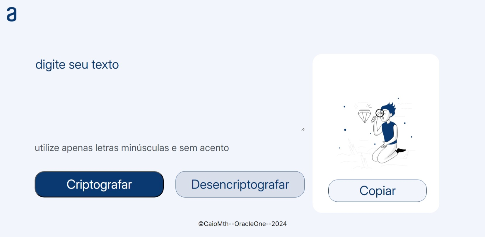

<h1 align="center">Decodificador de Texto</h1>
Este é um projeto cujo objetivo é criptografar mensagens do usuário de modo a ser possível descriptografá-las posteriormente.

> Funciona apenas com letras minúsculas (o programa irá transformar letras maiúsculas em minúsculas) e sem acentuação ou caracteres especiais (serão ignorados).

## 🔎 Como funciona?
1. Insira o texto na esquerda;
2. Selecione criptografar ou descriptografar;
3. A mensagem será mostrada à direita.
> Opcional: Utilize o botão copiar para acessar a mensagem rapidamente.

## 🌠 Preview

